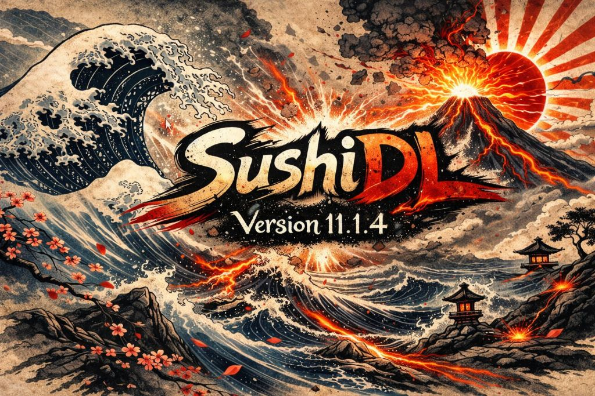

<p align="center">
  
</p>

# 🍣 SushiDL – Téléchargeur de mangas avec interface graphique

**SushiDL** est une application Python moderne avec interface Tkinter permettant de télécharger automatiquement des chapitres ou tomes de mangas depuis **[sushiscan.fr](https://sushiscan.fr)** et **[sushiscan.net](https://sushiscan.net)**.  
Pensé pour être simple, rapide et efficace, il offre des fonctionnalités avancées comme la gestion de cookies Cloudflare, la conversion en `.cbz`, et une interface filtrable dynamique.

**Version actuelle : `11.1.4`**

---

## ✨ Fonctionnalités
- 🧠 Analyse des chapitres améliorée : prise en charge des chapitres sans `ts_reader.run(...)` via parsing du DOM `#readerarea`
- 🛡️ Gestion indépendante des cookies `.fr` / `.net`
- ✍️ Authentification **100% manuelle** (cookies `.fr` / `.net` + User-Agent)
- 🔗 Placeholders guidés dans les champs :
  - Cookie `.fr` / `.net` → `Coller ici votre cookie cf_clearance. Cliquer sur "Aide Cookie" si besoin.`
  - User-Agent (cliquable) → `https://httpbin.org/user-agent`
- 🌐 Détection des sous-domaines SushiScan (`c1.sushiscan.net`, etc.) pour appliquer automatiquement cookie/UA sur les images et la couverture
- 🏷️ Libellés d’authentification simplifiés + badges `Valide` / `Invalide` / `A contrôler`
- 🧩 Téléchargement en accès direct uniquement (pas de fallback FlareSolverr/Playwright/import navigateur)
- 🧯 Gestion robuste des erreurs : distinction entre page manquante (`404/410`) et ressource bloquée/non téléchargeable
- ❌ Annulation fiable à tout moment
- 🖼️ Conversion `.webp` → `.jpg`
- 📦 Génération automatique de fichiers `.cbz`
- 📚 Nommage harmonisé en **Tome** (GUI, logs, dossiers, CBZ)
- 📊 Barre de progression en temps réel
- 🧾 Logs unifiés GUI + terminal, filtrables (`all/info/success/warning/error/debug/cbz`)
- 📋 Journal enrichi : copier, exporter, effacer, auto-scroll
- 🎨 Interface modernisée (look & feel inspiré Breeze : lisibilité, contrastes, espacements)
- 🧭 Actions de sélection/téléchargement intégrées dans l’en-tête `Tomes / Chapitres`
- 🏷️ Version affichée au lancement (console + interface)
- 💾 Paramètres persistants (`cookie_cache.json`) + configuration globale (`config.json`)

---

## 🔢 Versioning & Changelog

Le projet suit le format `X.Y.Z` :
- `X` = **ÉVOLUTION MAJEURE**
- `Y` = **AMÉLIORATION** / fonctionnalité secondaire
- `Z` = **BUGFIX**

Exemples :
- `10.0.1` = correction de bug
- `10.1.0` = amélioration/fonctionnalité secondaire
- `11.0.0` = évolution majeure

📘 Historique des changements : [`CHANGELOG.md`](CHANGELOG.md)

---

<p align="center">
  <strong>❤️ Si ce projet vous a été utile, vous pouvez le soutenir sur Ko-Fi</strong>
</p>

<p align="center">
  <a href="https://ko-fi.com/itanivalkyrie" target="_blank">
    
  </a>
</p>

<p align="center">
  🙏 Merci d'utiliser SushiDL 🍣 !
</p>

---

## 🐍 Installer Python

### 🪟 Sur Windows

1. Rendez-vous sur le site officiel :  
   👉 [https://www.python.org/downloads/windows/](https://www.python.org/downloads/windows/)
2. Téléchargez la dernière version **Python 3.10 ou supérieure**
3. **IMPORTANT** : cochez la case ✅ **"Add Python to PATH"** avant de cliquer sur "Install Now"
4. Une fois l'installation terminée, ouvrez l'invite de commandes (`cmd`) et vérifiez :

```bash
python --version
```

### 🐧 Sur Linux (Debian/Ubuntu)

```bash
sudo apt update
sudo apt install python3 python3-pip python3-tk
```

Puis vérifiez :

```bash
python3 --version
```

---

## 🚀 Installation

### 📥 Cloner le dépôt depuis GitHub

```bash
git clone https://github.com/itanivalkyrie/SushiDL.git
cd SushiDL
```

1. Assurez-vous d’avoir **Python 3.10+**
2. Installez les dépendances :

```bash
pip install -r requirements.txt
```

> 💡 Sous Linux, utilisez `pip3` si nécessaire

---

## ▶️ Exécution du script

### 🪟 Sous Windows

```bash
cd chemin\vers\le\dossier
python SushiDL.py
```

### 🐧 Sous Linux

```bash
cd /chemin/vers/le/dossier
python3 SushiDL.py
```

---

## 🔐 Récupérer `User-Agent` et `cf_clearance`
SushiDL est désormais en mode **manuel uniquement**.

1. Ouvrez `https://sushiscan.fr` et `https://sushiscan.net` dans votre navigateur.
2. Récupérez les cookies `cf_clearance` (un par domaine).
3. Récupérez votre User-Agent via :
   - `https://httpbin.org/user-agent`
   - ou les outils développeur du navigateur.
4. Collez les valeurs dans l’application puis cliquez sur **Sauvegarder Parametres**.

💡 Dans la GUI, les champs cookies affichent un texte guide (non cliquable) et le champ User-Agent reste cliquable.
💡 Le bouton **Aide Cookie** ouvre directement la section du README dédiée à la récupération de `cf_clearance` et du `User-Agent`.

### ⚙️ `config.json` (mode manuel)

```json
{
  "auth_mode": "manual",
  "manual_links": {
    "cookie_fr": "https://sushiscan.fr",
    "cookie_net": "https://sushiscan.net",
    "user_agent": "https://httpbin.org/user-agent",
    "cookie_help": "https://github.com/itanivalkyrie/SushiDL?tab=readme-ov-file#-r%C3%A9cup%C3%A9rer-user-agent-et-cf_clearance"
  }
}
```

### 📎 Depuis Google Chrome

1. Visitez [https://sushiscan.fr](https://sushiscan.fr) ou [https://sushiscan.net](https://sushiscan.net)
2. Ouvrez les outils de développement `F12` → **Réseau**
3. Rechargez la page
4. Cliquez sur la première ligne (document)
5. Dans **En-têtes (Headers)** :
   - Copiez le champ `User-Agent`
   - Recherchez `cf_clearance` dans les cookies

### 🦊 Depuis Firefox

1. Rendez-vous sur [https://sushiscan.fr](https://sushiscan.fr) ou [https://sushiscan.net](https://sushiscan.net)
2. `Ctrl+Maj+I` → Onglet **Réseau**
3. Rechargez
4. Cliquez sur la première requête
5. Copiez :
   - Le `User-Agent`
   - Le cookie `cf_clearance`

🧠 Collez ces infos dans l'application → **Sauvegarder Paramètres**

---

## 🔧 Utilisation

1. Lancez `SushiDL.py`
2. Entrez une URL de manga depuis sushiscan.fr ou sushiscan.net
3. Cliquez sur **Analyser**
4. Filtrez, sélectionnez ou inversez les tomes/chapitres
5. Cliquez sur **Télécharger** pour générer vos `.cbz`

📁 Les fichiers seront placés dans le dossier `DL SushiScan/`.

---

## 🧠 Détails techniques

- Pipeline de téléchargement robuste (retry direct uniquement)
- Distinction des erreurs :
  - `404/410` = page absente côté serveur (le tome peut être finalisé)
  - `403/429/...` = blocage/réseau (intervention manuelle requise)
- Annulation stable pendant les téléchargements parallèles
- Création de CBZ possible même avec pages manquantes non bloquantes
- Conversion automatique d’images `.webp` en `.jpg`
- Génération propre de `.cbz` avec suppression du dossier temporaire
- Interface fluide avec journal d’activité avancé
- Sauvegarde persistante dans `cookie_cache.json`
- Configuration globale dans `config.json` (mode manuel)
- Prise en charge de `sushiscan.fr` **et** `sushiscan.net`

---

## 📂 Arborescence du projet

- `SushiDL.py` : version principale
- `legacy_scripts/SushiDL_V9.py` : version historique conservée
- `tools/remove_last_images_cbz.py` : outil de nettoyage des CBZ
- `cut_sushiscan_fr/` : scripts de reconstruction/coupe d’images
- `CHANGELOG.md` : historique des versions et changements

---

## 🧹 Script complémentaire : suppression automatique des dernières images `.cbz`

Le script `tools/remove_last_images_cbz.py` permet de nettoyer automatiquement les fichiers `.cbz` contenant des images publicitaires ou parasites ajoutées en fin de chapitre (notamment sur **sushiscan.fr**).

---

### ✨ Fonctionnalités :

- ✅ Suppression automatique d’un nombre défini d’images en fin de fichier
- 🖱️ Compatible glisser-déposer d’un **dossier** ou d’un **fichier unique**
- 🔁 Traitement en boucle : possibilité d’enchaîner plusieurs nettoyages sans redémarrer
- 🧠 Détection automatique : fichier `.cbz` unique ou dossier contenant plusieurs `.cbz`
- 📦 Création automatique d’une sauvegarde `.bak` de l’ancien fichier
- 🧾 Résumé final du nombre total d’images supprimées

---

### 📌 Exemple d’utilisation :

1. Lancez le script :

```bash
python tools/remove_last_images_cbz.py
```

2. Entrez (ou glissez) un fichier `.cbz` ou un dossier
3. Indiquez le nombre d’images à supprimer (défaut : 7)
4. Laissez le script agir. Une sauvegarde `.bak` est créée.

Vous pouvez relancer l’opération autant de fois que nécessaire.

---

## 🖼️ Aperçu


